Dashboard Sistem Penyewaan Kios Berbasis Web
(Studi Kasus: UPT Pengelolaan Retribusi Wilayah I Dinas Perindustrian dan Perdagangan Kawasan Pasar Beringharjo Timur Kota Yogyakarta)
================================================
Jan 2021 - Jun 2021
KP (Kerja Praktik)

Membuat dashboard sistem untuk membantu petugas dan pedagang dalam melakukan proses penyewaan dan pembayaran yang terdiri dari 2 web yaitu:

- Web untuk Petugas
- Web untuk kepala UPT

### Teknologi yang digunakan:

MySQL

### Library yang digunakan:

Bootstrap (CoolAdmin admin dashboard template)

### Software tool:

Visual Studio Code, Xampp

### Bahasa:

PHP, CSS, HTML, JavaScript

### Fitur:

Web Petugas & Kepala UPT:

- Login
- Register
- Dashboard
- Data Kios
- Data Penyewa Kios
- Data Transaksi
- Laporan Perbulan
- Laporan Pertahun
- Tambah Data Penyewa Baru
- Search Data
- Print
- Profile
- Logout
- Dashboard Kepala UPT (hanya dapat melihat dan mencetak data/laporan)

# Preview

### Screenshot

### Login

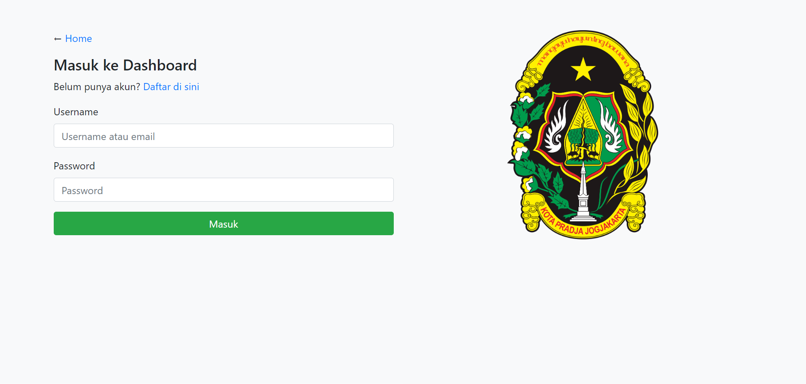

### Registrasi

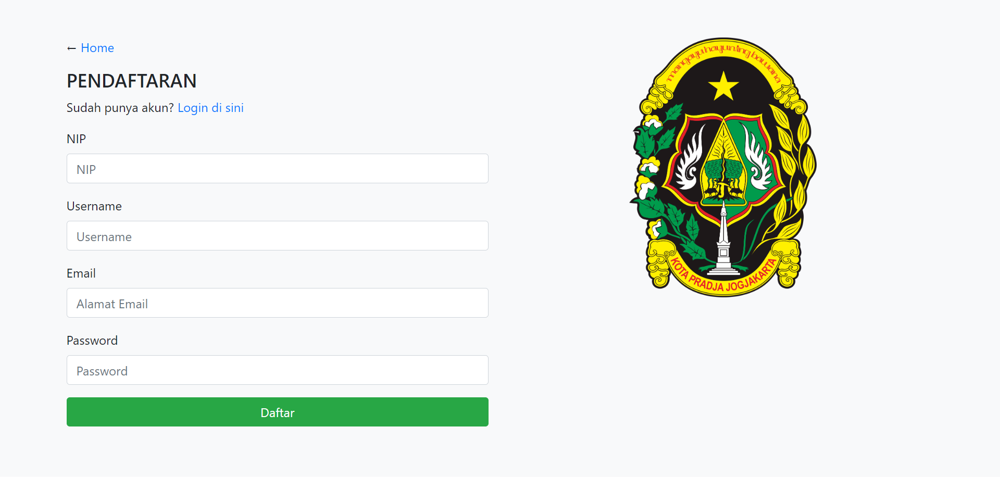

### Dashboard Petugas

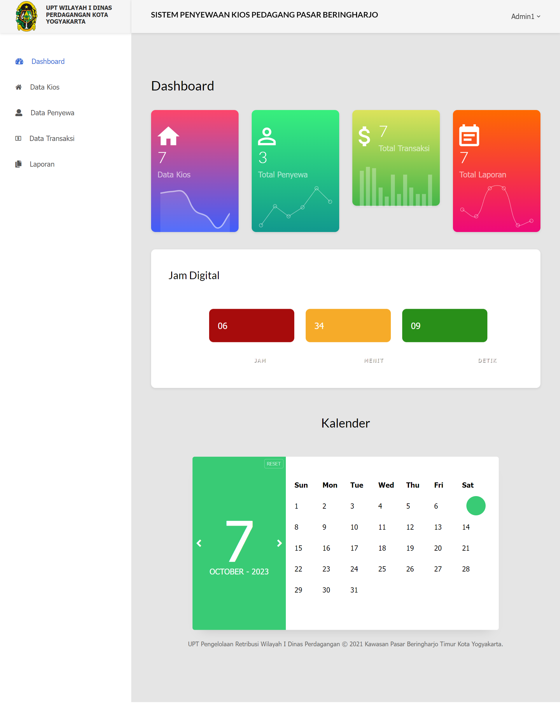

### Data Kios

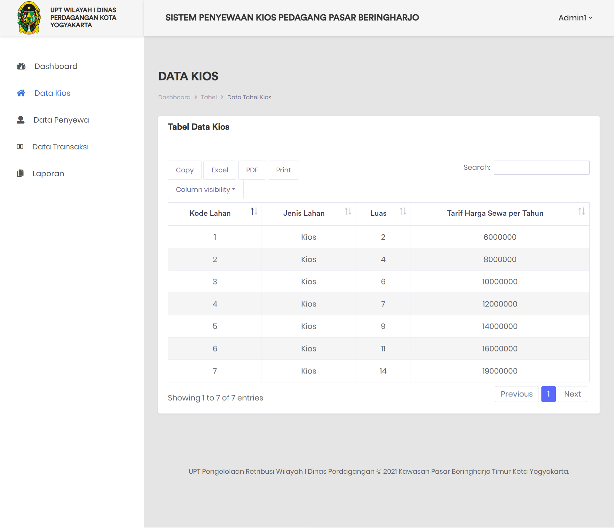

### Data Pedagang Penyewa Kios

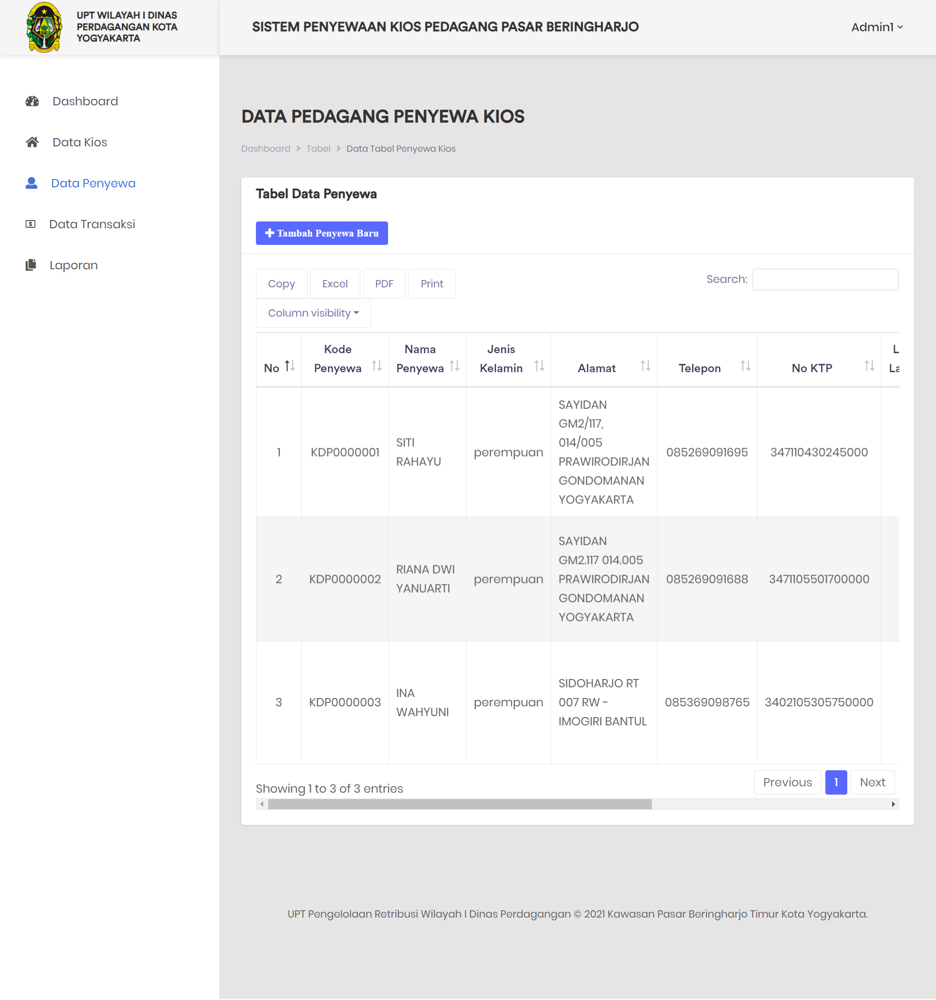

### Tambah Data Penyewa Kios

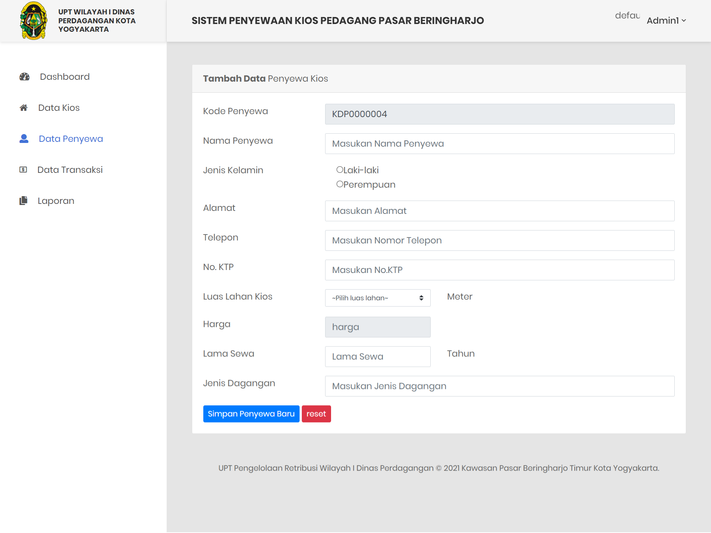

### Data Transaksi

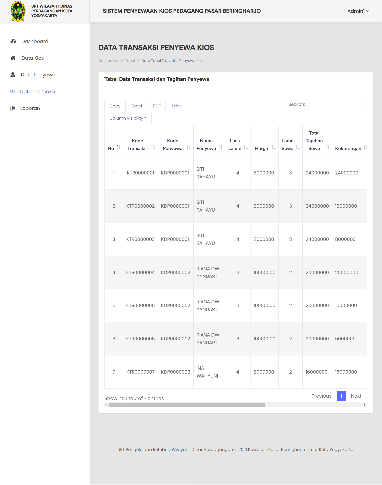

### Laporan Perbulan

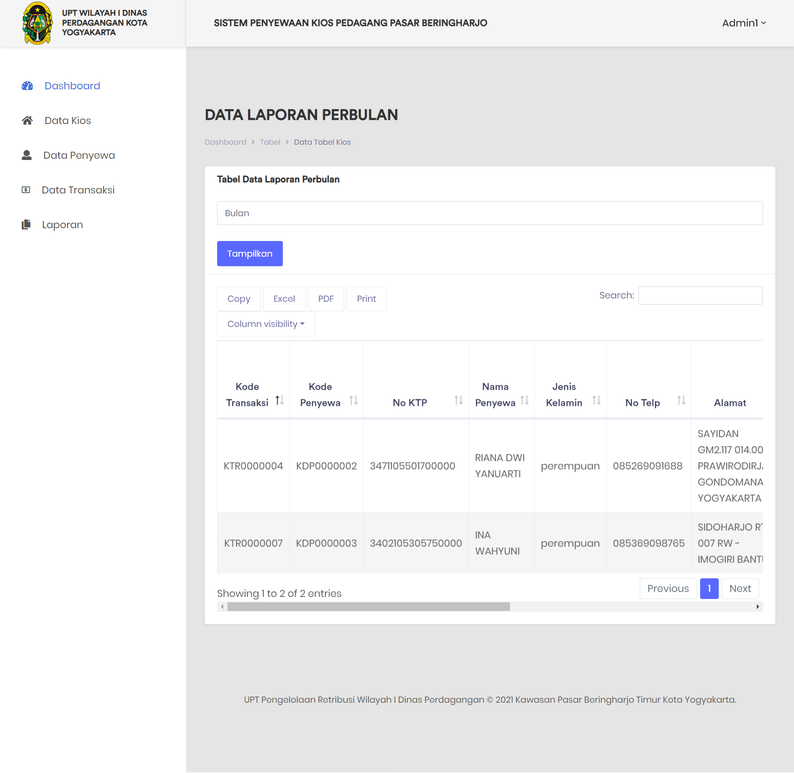

### Laporan Pertahun

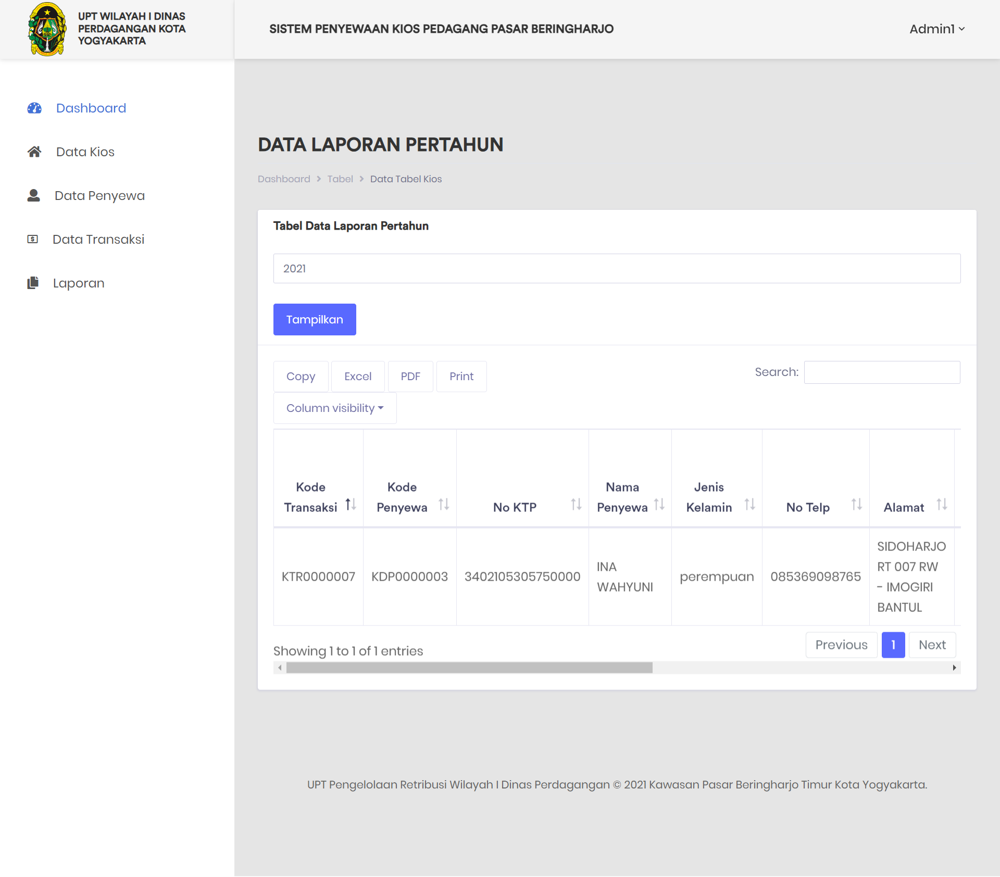

### Profile

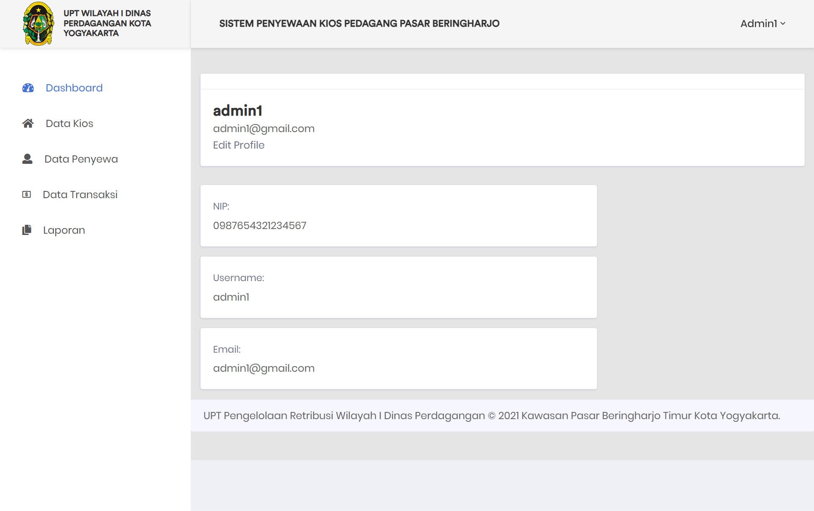

### Dashboard Kepala UPT

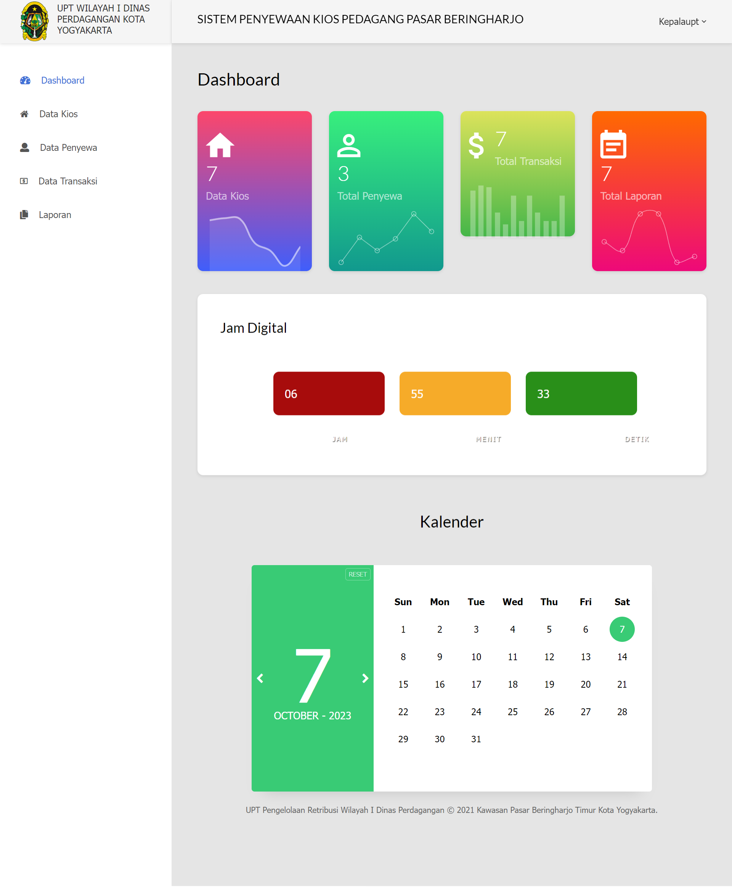
